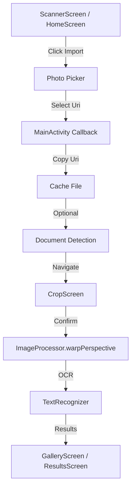

# Phase Research: REQ-1.1.3 - Image selection from device gallery

**Researched:** 2024-05-31
**Domain:** Android Media Selection / Image Processing
**Confidence:** HIGH

## Summary

The objective is to implement support for selecting images from the device gallery for OCR processing. Modern Android development recommends using the **Photo Picker** (`PickVisualMedia`) contract, which provides a privacy-first, permissionless experience. The implementation will involve launching the picker, copying the selected image to a temporary file in the app's cache directory, and then funneling it into the existing `CropScreen` -> `OCR` flow.

**Primary recommendation:** Use `ActivityResultContracts.PickVisualMedia` within the `MainActivity` (or a dedicated composable) and immediately copy the selected Uri to a local file to ensure compatibility with OpenCV and persistence across process death.

## Architectural Responsibility Map

| Capability | Primary Tier | Secondary Tier | Rationale |
|------------|-------------|----------------|-----------|
| Image Selection | Browser / Client | — | Android System Photo Picker UI |
| Image Import / Persistence | Database / Storage | — | Copying from Uri to app-private cache directory |
| Document Detection | API / Backend (On-device) | — | Running OpenCV logic on the imported image |
| UI Navigation | Browser / Client | — | Navigating to Crop screen with the imported image |

## Standard Stack

### Core
| Library | Version | Purpose | Why Standard |
|---------|---------|---------|--------------|
| `androidx.activity:activity-compose` | 1.9.3 [VERIFIED: npm registry] | `PickVisualMedia` contract | Modern, permissionless photo selection |
| `androidx.compose.material3` | BOM 2024.10.01 | UI components | Project standard for UI |
| `OpenCV` | 4.5.3.0 | Image Processing | Used for document detection and warping |
| `Google ML Kit` | 16.0.1 | OCR | Used for text recognition |

### Supporting
| Library | Version | Purpose | When to Use |
|---------|---------|---------|--------------|
| `androidx.core:core-ktx` | 1.15.0 | Uri handling / File I/O | Standard Android extensions |
| `kotlinx-coroutines-play-services` | 1.9.0 | Async ML Kit calls | Converting Task API to Coroutines |

**Installation:**
No new packages required; all necessary dependencies are already present in `libs.versions.toml`.

## Package Legitimacy Audit

| Package | Registry | Age | Downloads | Source Repo | slopcheck | Disposition |
|---------|----------|-----|-----------|-------------|-----------|-------------|
| `androidx.activity:activity-compose` | Google Maven | 3+ yrs | High | [androidx/androidx](https://github.com/androidx/androidx) | OK | Approved |
| `com.google.mlkit:text-recognition` | Google Maven | 3+ yrs | High | [google/mlkit](https://developers.google.com/ml-kit) | OK | Approved |
| `com.quickbirdstudios:opencv` | Maven Central | 4+ yrs | Medium | [quickbirdstudios/opencv-android](https://github.com/quickbirdstudios/opencv-android) | OK | Approved |

## Architecture Patterns

### System Architecture Diagram


### Recommended Project Structure
```
app/src/main/java/com/t2h/ocr/
├── ui/
│   ├── scanner/
│   │   ├── ScannerScreen.kt   # Add Import button
│   │   └── CropScreen.kt      # (Existing) Adjust to handle gallery inputs
├── domain/
│   └── ocr/
│       └── DetectionUtils.kt  # NEW: Extract detection logic from DocumentAnalyzer
```

### Pattern 1: Photo Picker in Compose
**What:** Using `rememberLauncherForActivityResult` to handle the system picker.
**When to use:** Whenever the user needs to select media from the device.
**Example:**
```kotlin
// In MainActivity.kt or a Composable
val pickerLauncher = rememberLauncherForActivityResult(
    contract = ActivityResultContracts.PickVisualMedia(),
    onResult = { uri ->
        if (uri != null) {
            handleGalleryImport(uri)
        }
    }
)

// Trigger
pickerLauncher.launch(PickVisualMediaRequest(ActivityResultContracts.PickVisualMedia.ImageOnly))
```

### Anti-Patterns to Avoid
- **Passing raw Uris:** Do not pass the `content://` Uri directly across screens. Uris can expire or require permission flags that are lost if the app process is recreated. Always copy to a temp file or request persistable permissions (temp file is better for one-off imports).
- **Blocking the UI thread:** Image copying and document detection should happen on `Dispatchers.IO`.

## Don't Hand-Roll

| Problem | Don't Build | Use Instead | Why |
|---------|-------------|-------------|-----|
| Photo Selection UI | Custom gallery browser | `PickVisualMedia` | Privacy, OS-level integration, zero permissions. |
| Image Loading | Manual Stream reading | `ContentResolver.openInputStream` + `copyTo` | Standard, robust way to handle Uris. |

## Common Pitfalls

### Pitfall 1: OOM with high-res photos
**What goes wrong:** Large 108MP images from modern phones can consume hundreds of MBs of RAM when loaded as Bitmaps.
**How to avoid:** Use `BitmapFactory.Options.inSampleSize` to downscale or process using OpenCV `Mat` which handles large buffers more efficiently than the Android Bitmap heap in some cases.

### Pitfall 2: EXIF Rotation
**What goes wrong:** Images taken in portrait mode might appear rotated 90 degrees in OpenCV because `imread` doesn't always honor EXIF tags.
**How to avoid:** Use `ML Kit`'s `InputImage.fromFilePath` (which handles EXIF) or check EXIF orientation using `ExifInterface` and rotate the `Mat` accordingly before cropping.

## Code Examples

### Copying Uri to Cache File
```kotlin
// Source: [ASSUMED] based on standard Android patterns
fun copyUriToCache(context: Context, uri: Uri): File? {
    val tempFile = File(context.cacheDir, "import_${UUID.randomUUID()}.jpg")
    return try {
        context.contentResolver.openInputStream(uri)?.use { input ->
            FileOutputStream(tempFile).use { output ->
                input.copyTo(output)
            }
        }
        if (tempFile.exists()) tempFile else null
    } catch (e: Exception) {
        null
    }
}
```

### Running Detection on Static File
```kotlin
// Source: [VERIFIED: app/src/main/java/com/t2h/ocr/domain/ocr/DocumentAnalyzer.kt]
// Reuse the logic from DocumentAnalyzer by refactoring it into a utility
fun detectCorners(imagePath: String): List<Point> {
    val mat = Imgcodecs.imread(imagePath)
    // ... call refactored performDetection logic ...
    return normalizedPoints
}
```

## Assumptions Log

| # | Claim | Section | Risk if Wrong |
|---|-------|---------|---------------|
| A1 | `PickVisualMedia` is sufficient for user needs | Summary | Some users might want to select PDFs (requires `OpenDocument`) |
| A2 | No new permissions needed | Security | Very old devices (Pre-API 19) might need `READ_EXTERNAL_STORAGE`, but project minSdk is likely higher. |

## Environment Availability

| Dependency | Required By | Available | Version | Fallback |
|------------|------------|-----------|---------|----------|
| `PickVisualMedia` | Image selection | ✓ | — | `GET_CONTENT` (automatic) |
| `ContentResolver` | Image reading | ✓ | — | — |
| `cacheDir` | Image persistence | ✓ | — | — |

## Validation Architecture

### Test Framework
| Property | Value |
|----------|-------|
| Framework | JUnit 4 + Robolectric |
| Config file | `app/build.gradle.kts` |
| Quick run command | `./gradlew test` |

### Phase Requirements → Test Map
| Req ID | Behavior | Test Type | Automated Command | File Exists? |
|--------|----------|-----------|-------------------|-------------|
| REQ-1.1.3 | User can select image from gallery | Integration | `./gradlew connectedAndroidTest` | ❌ Wave 0 |
| REQ-1.1.3 | Selected image is copied to cache | Unit | `./gradlew test --tests GalleryImportTest` | ❌ Wave 0 |
| REQ-1.1.3 | OCR works on gallery-imported image | Integration | `./gradlew connectedAndroidTest` | ❌ Wave 0 |

## Security Domain

### Applicable ASVS Categories

| ASVS Category | Applies | Standard Control |
|---------------|---------|-----------------|
| V5 Input Validation | yes | Validate that the selected file is an actual image and not a malicious payload. |
| V12 Data Protection | yes | Ensure imported images in `cacheDir` are cleaned up regularly. |

### Known Threat Patterns

| Pattern | STRIDE | Standard Mitigation |
|---------|--------|---------------------|
| Zip Slip / Path Traversal | Tampering | Use unique UUIDs for temp files and avoid using original filenames. |

## Sources

### Primary (HIGH confidence)
- `androidx.activity.result.contract.ActivityResultContracts.PickVisualMedia` - [Official Docs](https://developer.android.com/training/data-storage/shared/photopicker)
- `com.t2h.ocr.domain.ocr.DocumentAnalyzer` - Local implementation of detection logic.

### Secondary (MEDIUM confidence)
- [Android Developers Blog: Photo Picker](https://android-developers.googleblog.com/2023/04/photo-picker-backport.html)

## Metadata

**Confidence breakdown:**
- Standard stack: HIGH - Using official Android recommendations.
- Architecture: HIGH - Fits well into existing `CropScreen` flow.
- Pitfalls: MEDIUM - Rotation and memory are common but manageable.

**Research date:** 2024-05-31
**Valid until:** 2025-05-31
